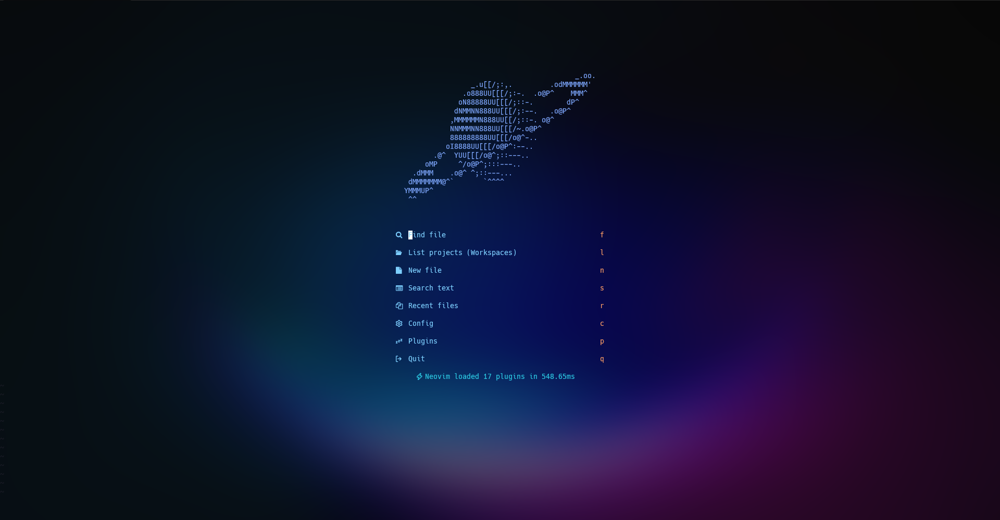
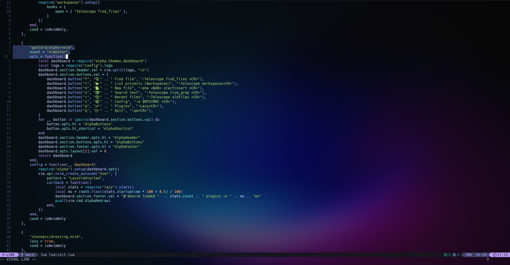

# Requirements

In order to use this config correctly you need to install some dependencies using package managers first.

## Chocolatey

Some of the packages are required to be installed through your operating system package manager first, in this case I'm using [chocolatey](https://chocolatey.org/install) for Windows. Use your favorite package manager to install those.

```bash
choco install ripgrep fd llvm mingw tree-sitter
```

## NPM

We use `tsserver` LSP so we need to ensure the following packages are installed globally.

```
npm install -g typescript typescript-language-server
```

## Screenshots

<div align="center">

# 

# 

</div>
